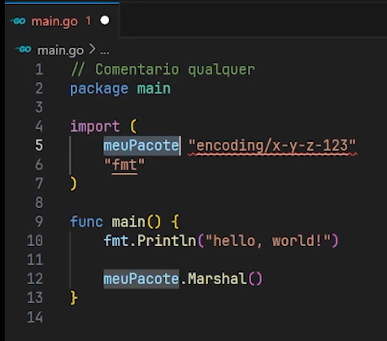

# Fundamentos do Go

## Package

Em Go, **todos os arquivos** devem começar com a declaração de um package. A única exceção a essa regra são os comentários, que podem vir antes da declaração do package.

No momento de importar outros pacotes, é possível criar **alias** para esses pacotes. Alias são utilizados para facilitar a referência a pacotes dentro do código.

### Importando Pacotes

Pacotes da **standard library** (biblioteca padrão do Go) **não recebem alias** por uma questão de padronização. Isso torna o código mais legível e facilita a compreensão de quais pacotes estão sendo utilizados.

#### Dot Import

Se você encontrar um import com um alias sendo um **"."**, isso significa que é um **dot import**. Com esse tipo de import, todas as funções, variáveis e tipos do pacote importado são inseridos diretamente no escopo atual, como se fossem parte do pacote onde estão sendo usados.

> **Atenção:** *Dot import não é uma prática recomendada!* Ele pode tornar o código confuso, dificultando a identificação de onde as funções e tipos foram definidos.

#### Underscore Import

Outro tipo de import é o com um alias **"_"**. Esse tipo de import é conhecido como **blank import**. O blank import **não traz** diretamente os elementos do pacote para o escopo atual. Ele é usado para executar o `init()` do pacote ou para registrar drivers, sem realmente utilizar as funções ou variáveis do pacote.

### Retrocompatibilidade

Uma das promessas do Go é a **retrocompatibilidade eterna**. Isso significa que futuras versões da linguagem não quebrarão o código escrito em versões anteriores, garantindo que o código seja durável e estável ao longo do tempo.

## Nomes Públicos e Privados

Em Go, a visibilidade de identificadores (como variáveis, funções, e structs) é determinada pela capitalização de seus nomes:

- **Público**: Quando o nome começa com uma letra maiúscula, ele é exportado, ou seja, pode ser acessado fora do pacote onde foi definido.
- **Privado**: Quando o nome começa com uma letra minúscula, ele é privado ao pacote, ou seja, só pode ser acessado dentro do próprio pacote.

Essa regra simples garante que a organização do código seja clara e que os pacotes possam encapsular suas implementações internas.

## Funções

Funções em Go são blocos de código reutilizáveis que executam uma tarefa específica. Elas são definidas com a palavra-chave `func` e podem ou não retornar valores. Funções são fundamentais para a modularização e organização do código.

### Funções Nomeadas

Em Go, funções podem retornar múltiplos valores. Além disso, é possível nomear os valores de retorno, o que pode melhorar a legibilidade do código ao indicar claramente o que cada valor representa.

### Escopo das Funções

Funções têm escopo próprio, ou seja, variáveis declaradas dentro de uma função só podem ser acessadas dentro dela. Isso ajuda a evitar conflitos de nomes e mantém o código mais limpo e organizado.

## Variáveis

Variáveis são usadas para armazenar valores que podem mudar durante a execução do programa. Em Go, as variáveis podem ser declaradas de diferentes maneiras, mas sempre respeitando o sistema de tipos estáticos da linguagem.

### Inferência de Tipo

Embora Go seja uma linguagem fortemente tipada, o compilador pode inferir o tipo de uma variável com base no valor que lhe é atribuído. Isso simplifica a sintaxe, mas o tipo da variável ainda é definido no momento da compilação.

## Sistema de Tipos

Go possui um sistema de tipos estático e forte, onde o tipo de cada variável é conhecido em tempo de compilação. Isso significa que erros de tipo podem ser detectados cedo, aumentando a segurança do código.

### Tipos Primitivos e Compostos

- **Tipos Primitivos**: Incluem `int`, `float`, `string`, `bool`, entre outros.
- **Tipos Compostos**: Incluem arrays, slices, structs, maps, channels, e interfaces. Cada um desses tipos tem suas próprias características e usos específicos.

## Constantes

Constantes são valores que não podem ser alterados após a sua declaração. Elas são úteis para definir valores fixos que não devem mudar durante a execução do programa. Em Go, as constantes podem ser de qualquer tipo básico, como números, strings e booleanos.

### iota

`iota` é uma ferramenta do Go usada para criar sequências numéricas automaticamente. Ele é comumente usado na criação de grupos de constantes relacionadas.

## Arrays

Arrays são coleções de elementos de um mesmo tipo, organizados em uma sequência contígua de memória. Em Go, os arrays têm tamanho fixo, que é parte do seu tipo. Eles são úteis para armazenar uma coleção de elementos quando o tamanho é conhecido e constante.

### Limitações dos Arrays

Devido ao seu tamanho fixo, arrays em Go são menos flexíveis que slices. No entanto, eles podem ser úteis em situações onde a alocação de memória fixa é desejável por questões de performance ou previsibilidade.

## Loops

O único tipo de loop em Go é o `for`, que pode ser usado de diversas formas para iterar sobre arrays, slices, maps, e outros coletores de dados. Ele pode funcionar como um loop clássico com inicialização, condição e pós-execução, ou como um loop `while`.

### Loop Infinito

Um loop sem condição de parada é considerado um loop infinito e é útil em situações onde a execução deve continuar indefinidamente até que uma condição interna seja atendida.

## Condicionais

As estruturas condicionais em Go utilizam `if`, `else if`, e `else` para tomar decisões baseadas em expressões booleanas. Não é necessário usar parênteses em torno das condições, mas as chaves são obrigatórias, mesmo para blocos de uma única linha.

### Atribuições em Condicionais

Em Go, é possível realizar uma atribuição dentro de uma expressão condicional. Isso pode ser útil para criar variáveis locais que são usadas apenas dentro do bloco condicional.

## Switches

A declaração `switch` em Go é usada para executar um de vários blocos de código com base no valor de uma expressão. Ela substitui várias declarações `if-else` encadeadas e melhora a legibilidade do código.

### Fallthrough e Default

Por padrão, cada caso em um `switch` não executa os casos seguintes (não há "fallthrough"). No entanto, é possível usar a palavra-chave `fallthrough` para forçar a execução do próximo caso. O bloco `default` é executado se nenhum dos casos correspondentes for encontrado.

## Defer

A palavra-chave `defer` em Go adia a execução de uma função até que a função que a contém seja encerrada. `defer` é comumente usado para liberar recursos, como fechar arquivos ou conexões de banco de dados, garantindo que essas ações ocorram mesmo se ocorrer um erro dentro da função.

### Execução de `defer`

As funções adiadas com `defer` são executadas na ordem inversa em que foram chamadas. Isso é útil em situações onde múltiplos recursos precisam ser liberados na ordem inversa em que foram adquiridos.
